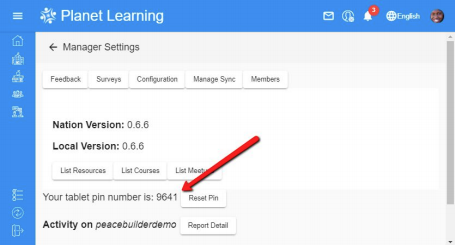
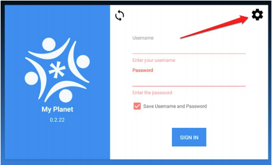
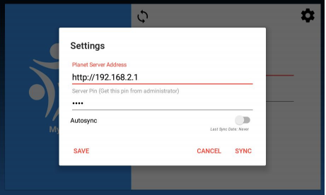
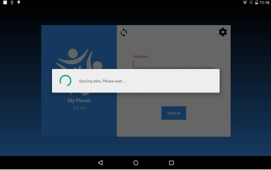
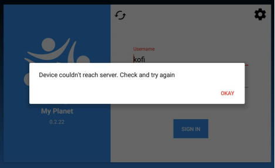

# myPlanet Tutorial

## Objectives

* Understand how to install myPlanet
* Understand basic functions of myPlanet

## Preparation
myPlanet application is only available for Android devices. You can find myPlanet application in play store.

If you follow this link for [myPlanet on Play Store](https://play.google.com/store/apps/details?id=org.ole.planet.myplanet) you will be able to reach myPlanet in playstore. You can then install myPlanet from there on your phone.

NOTE: If you don't have access to an Android device, you can skip this step.

## Overview of myPlanet

myPlanet is the our mobile effort of Planet application. myPlanet connect with Planet server to get data. Using myPlanet you can have offline experience of our Planet application.

We suggest you play around a bit, try to explore and feel comfortable with myPlanet.

## Configure myPlanet

Login in to the local RPi Planet server as the admin user and navigate to the Manager Setting page. Note the Tablet Pin number. In the below example the Tablet Pin number is 9641.

Switch to the Tablet and Open the My Planet App.
(If you do not have My Planet App, then open http://192.168.2.1/fs/myPlanet.apk on tablet browser to download and install)

At the login screen click the Gear icon top right corner

On the resulting screen, enter the local server IP Address in the form of a URL. URL will be what you open on browser to use planet. Unless you received special instructions, enter: http://192.168.2.1. Also, enter the Pin from Step 1 above

There is option to auto sync myPlanet with planet server continuously. This will force the application to save data to the server if it is available. You can set interval of syncing as shown in figure

Click SYNC to save the configuration and to perform the first sync with the local Planet server.

**Troubleshooting**

If there is an error connecting to the local Planet server you will see the following screen:

Solution:
1. Check WIFI connection. The tablet MUST be connected to the same WIFI network.
2. Check that all information above was entered correctly.
3. Re-check Pin.