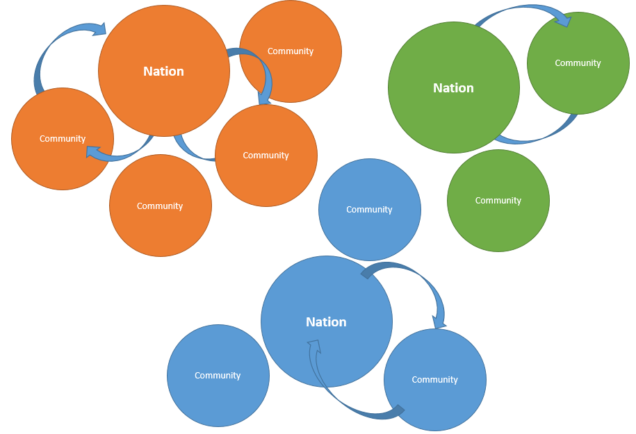
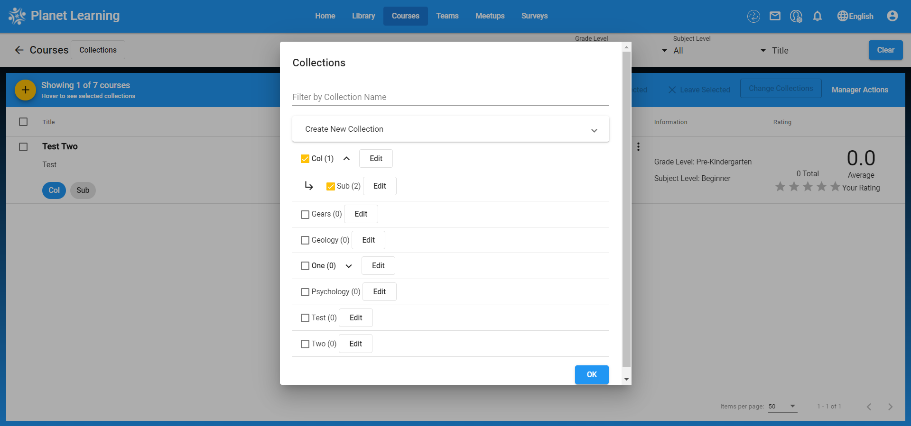

# Open Learning Exchange

# OLE

The [**Open Learning Exchange (OLE)**](http://ole.org) is committed to ensuring that everyone, especially children, has access to a high quality basic education. We work with nation-based entrepreneurs, educators, and practitioners committed to promoting highly effective and affordable learning systems that can benefit all of their people. We believe this will lead to more productive lives, communities, and nations, and to the possibility of a peaceful world. 

OLE’s mission is to ensure learning for all, not only universal basic literacy and numeracy, but also vital knowledge and skills acquisition in the areas of health, nutrition, community development. Since 2007, OLE International has helped establish Open Learning Communities for children, adolescents, and young adults, including those whose lives have been disrupted by violent conflicts.  Today there are OLE affiliates in Asia, Africa, the Middle East, and Latin America.

# PLANET

## Introduction

### _What is the OLE Planet Learning System (Planet)?_

Personalized Learning And Networked Enabled Teams (Planet) is a multilingual learning system and library with thousands of educational resources including books, videos, and educational games. The system also includes software tools for content and student management, student evaluation and monitoring, and Courses creation.

At the core, Planet is a repository of free, open access, and public domain resources designed to benefit literate and preliterate, young and old, and novice and expert learners of all ages. Resources of all kinds (literature, health, science, math, etc.), in various languages (English, Somali, Swahili, Arabic, Spanish, etc.), and in various formats (text, audio, video) are continually being added to Planet.

The Planet system exists in the cloud but it can also be configured to run locally without the need for internet connectivity making it a viable solution for remote locations where internet connectivity is unreliable or nonexistent. Planet facilitates frequent assessments of learners, leaders, and administrators. It also promotes the evaluation and effectiveness of the learning resources. Robust usage feedback metrics make Planet a powerful tool for those overseeing monitoring and evaluation of the education system.

### _What are Planet Nations and Communities?_

Under the Planet system, there are two types of structures: **Nations** and **Communities**.

* **Nations**
  * **Nations** always exist in the cloud and require an internet connection to access.
  * Each **Nation** serves as a central repository for the **Community** or a group of communities that it serves.
  * Different **Nations** cannot connect to each other.

* **Communities**
  * A **Community** is a local installation of the Planet system.
  * A **Community** does not require an internet to access.
  * Users can connect to a **Community** using any device having a web browser like tablet, computer, etc. The connection is established via a router through a locally configured _intranet_.
  * Each **Community** connects periodically to a **Nation** via _internet_ in order to receive new materials and to upload user metrics.
  * A **Community** is not able to connect to other **Communities**.

The **nations** may store thousands of Resources in many formats and languages. Unique collections of Resources can be selected and downloaded into each **Community** from the **Nation**. This gives a Learner a personalized approach to his or her education.

## Become Member
To be able to use **PLANET** you need to be part of the system. First thing you 
will see on PLANET is **Login page**.

### How to get to Become Member
When you first open Planet, you will see the login page. Click on the "Become a member" button to create your account.

To return to the login page from the "Become a member" page, click on the "Already have an account?" button.

### Different kind of roles available in system
There are several different roles available in Planet: "admin", "manager", "learner", "leader", and "monitor". Members are "learners" by default, and only the "admin" is allowed to set specific roles of members.

### User profile
Click on the profile button in the top right corner of Planet. Here, you can view or edit your profile, change your password, or logout. Be sure to log out once you are finished with your session.

## Library
The Library is home to the community's collection of media and other resources.

### Getting to Library page
The Library page can be accessed through the menu bar at the top, or by clicking "Add item to myLibrary" on your dashboard.

### List of Resources
Here, you can view the list of all the resources available to you in the Library.

There are several different actions that can be performed in the library:

**Action Menu** - Here, you can add the resource to your library, give feedback, or download the resource.

**Rating** - You can rate resources from 1 to 5 stars, and also see the resources' average rating from other members.

**Selection** - By using these checkbox selectors, you can add or remove multiple resources from your library at the same time.

**Filter/Search** - To filter searches, click on the "Profile" button next to the search bar, then select your desired filters for a more advanced search.

**Pagination** - The paginator shows the number of search results, and allows you to select the number of results per page, and navigate between pages.

### Adding Resource
You can also add resources to the library. To do this, click on the "+" button, fill out the information about your resource, and upload it by clicking on the "Browse" button to select the file from your computer.

### Using collection of resource
The admin of the community can create "Collections" to categorize the resources. Members can also use these collections to view different groups of resources.

### Resource View
The resource view page looks like this:

On this page, you can open the resource in a new tab, add it to your library, and download it to your computer. In the resource viewer itself, you can also search for terms, jump to pages, zoom, and more.

## Courses
The Courses page is where you can create and join a variety of different courses where you can learn many different topics.

### Getting to the Courses Page
There are two ways to get to the Courses page:

1. From the Navigation Bar, click on the "Courses" Tab at the top.

2. From the dashboard tile, click on the "myCourses" tile right on the front page.

### List of Courses

Upon getting to the courses page, you will be greeted a page similar to the following, with each course being an item in a list.

By clicking on "Title", or "Rating", you are able to sort the course list accordingly.

### Actions on List Page

* Action Menu

The action menu has several different actions available.

1. To add a course, press the "+" button.

2. To join a course, select the checkbox next to a course then click the "Join Selected" button. The selected course is now part of your myCourses, and can be seen on the front page's dashboard. Multiple courses are able to be joined at once.

Alternatively, click on your course on the courses list to get the course page then click the "Join" button near the top-right of the course page.

3. To leave a course, select the checkbox next to a course that you are already a part of then click the "Leave Selected" button. The selected course is no longer part of your myCourses, and can no longer be seen on the front page's dashboard. Multiple courses are able to be left at once.

Alternatively, click on your course on the courses list to get the course page then click the "Leave" button near the top-right of the course page.

4. To change a collection, select the checkbox next to a course then click "Change Collections". To learn what a collection is, click [here](#Course_Collections).

5. To send a newly created course to be updated in the remote database, select the checkbox next to a course, click on "Manager Actions", then click on "Send Courses". You will need to enter your administrator password.

6. To delete a course, select the checkbox next to a course, click on "Manager Actions", then click on the "Delete" button. Multiple courses are able to be deleted at once.

* Rating

By default, the rating on the right side of a course item shows the average rating of all users who have rated the particular course.

In order to add a rating for a course: 

1. Click on one of the stars to the right side of the course item, with 1 being the lowest rating and 5 being the highest.

2. A module will pop up, showing the rating you've added and an optional comment. You can also change your given rating on this page.

3. Your rating will be submitted and the average rating of the course will be updated once you click the "OK" button on the module.

* Search

At the search bar near the top-right of the page, you are able to search by Grade Level, Subject Level, and Title. The search will automatically be performed upon changing any of these three, so there is no need to type the Enter key or press a Submit button. Press the "Clear" Button to return all three fields to their defaults and show all available courses again.

For filtering by collection, please check out [Course Collections](#Course_Collections)

* Pagination

At the bottom-right of the page, you can see your pagination options. You are able to have 5, 10, 20, 50, 100, or 200 courses per page, and the pages showing the course list will be split accordingly. Use the left and right arrow buttons to navigate in the case there are multiple pages.

### Adding Course

To begin adding a course, press the "+" button on the action menu.

You will be greeted by the following page:

The Course Title and Description fields are mandatory, along with Grade Level and Subject Level. Trying to submit the course without any of these will stop you.

Add a collection or subcollection to the course by clicking on the "Collections" button.

The following module will pop up:

You are able to filter your available collections by their name at the search bar near the top.

To create a new collection or to see the subcollection of a collection listed below, click on their respective dropdown buttons.

By clicking the "Edit" button next to each collection, you are able to change the collection's name and subcollection status.

To see what a collection is, try [Course Collections](#Course_Collections).

Clicking on the "Add Step" button near the bottom will reveal extra fields to the right of the page, as seen above. These steps are where you can give learning materials, tests, resources, and surveys. Click the "Delete" button near the top to cancel the step creation or click the "Add Step" button on the bottom of the page to add your newly created step.

When finished adding your steps, click the "Submit" button to create your Course.

* Tests

When creating a step, click on the "Add Test" button to create a test for what you have learned in the previous steps.

Upon clicking the "Add Question" button, you will find there are four types of questions based on two categories __Text__ and __Multiple Choice__:  

* Text - Simply fill out the question detail or query for this type of question. The test taker will automatically get a textbox for filling out his or her answer.  

	* Short answer: Usually single line short answers. 

	* Long answer: More possibly to be very long descriptive answers.	

* Multiple Choice - Click the "Add Choice" button to create a choice of answers for the question. The checkboxes denote the correct answers for the question and are required for creation of the question. Click the red circle button to the right of the choice to delete it from the question.
	* Single answer: Only __one__ checkbox can be chosen for this type of question.  
	In the image seen first below, the correct answer is set by checkbox to be the second choice, "Two".  
	
	* Multiple answer  
	In the image seen last below, the correct answer is set by checkbox to be the first, second, and fourth choices, "One", "Two", and "Four".

While multiple choice questions are automatically graded, text questions must be manually graded.

Fill out the appropriate fields on however many questions you want for this test. When you are finished, press the "Preview Test" button to preview how your test will look, then press the "Save" button to save the entire test.

* Resources

Clicking on the "Add Resources" button will display the list of resources in your current Library. Select one or more resource by checkbox to add the resources to the current step then click "OK" to add the resources to your step, or "Cancel" to return without adding them.

* Surveys

Surveys are nearly identical to tests in function, but are used for the purpose of collecting data from the course's students rather than testing their knowledge.

Upon clicking the "Add Question" button, you will find there are four types of questions based on two categories __Text__ and __Multiple Choice__:  

* Text - Simply fill out the question detail or query for this type of question. The survey taker will automatically get a textbox for filling out his or her answer.  
	* Short answer: Usually single line short answers. 

	* Long answer: More possibly to be very long descriptive answers.  

* Multiple Choice - Click the "Add Choice" button to create a choice of answers for the question. Click the red circle button to the right of the choice to delete it from the question. __Unlike tests, there are no checkboxes denoting the "correct" choice, as this is a survey.__  
	* Single answer  

	* Multiple answer  
	

Fill out the appropriate fields on however many questions you want for this survey. When you are finished, press the "Preview Survey" button to preview how your survey will look, then press the "Save" button to save the entire survey.

### Course Collections

Course collections are the categories that a course can have, assisting in finding a desired course when you want to search your list of courses by category.

Collections can be standalone without being a subcollection of another collection, or can set another collection as its supercollection, as long as that supercollection is not a supercollection of another collection. In other words, there can only be one layer of collection to subcollection correlation.

There are two ways of filtering the Courses page by collection:

1. By clicking on the "Collections" button next to "Courses" on the top-left of the page. This will bring up a module where you can filter the course list on the Courses page by selecting checkboxes next to collections and subcollections, seeing only the courses that have these collections or subcollections. 

You are also able to edit the course's name or subcollection status from this module.

2. By clicking directly on the collection name listed under the course, you can filter the courses by the clicked collection. Free collections are blue while subcollections are gray.

Note that this filtering is not retroactive, and clicking on a subcollection to click on its supercollection afterwards will not update the filtering to filter by the supercollection.

### Taking a Test

In order to take a test, you must first [join](#Actions_on_List_Page) the course. If you have not joined the course, you will only see the Preview button and not the Take Test button. The visuals of both are identical, but while previewing, you will not be able to submit your answers.

On the courses list, click on your desired course.

To take a test, click on the step with the associated test then click on "Take Test".

* Text - Short answer

Enter your answer in the textbox then click "Submit Answer" to submit your written answer.

* Text - Long answer

Enter your answer in the textbox then click "Submit Answer" to submit your written answer.

* Multiple Choice - single answer

Only a single answer may be selected by the radio buttons to the left of the answer choices. Click on "Submit Answer" to submit your selected answer. In the case that your answer is incorrect, the submission will fail and you will have to try again.

* Multiple Choice - multiple answer

Multiple answers may be selected by the checkboxes to the left of the answer choices. Click on "Submit Answer" to submit your selected answers. In the case that your answers are incorrect, the submission will fail and you will have to try again.

### Taking a Survey

In order to take a survey, you must first [join](#Actions_on_List_Page) the course. If you have not joined the course, you will only see the Preview button and not the Take Survey button. The visuals of both are identical, but while previewing, you will not be able to submit your answers.

On the courses list, click on your desired course.

To take a survey, click on the step with the associated survey then click on "Take Survey".

* Text - Short answer

Enter your answer in the textbox then click "Submit Answer" to submit your written answer.

* Text - Long answer

Enter your answer in the textbox then click "Submit Answer" to submit your written answer.

* Multiple Choice - single answer

Only a single answer may be selected by the radio buttons to the left of the answer choices. Click on "Submit Answer" to submit your selected answer.

* Multiple Choice - multiple answer

Multiple answers may be selected by the checkboxes to the left of the answer choices. Click on "Submit Answer" to submit your selected answers.

## Exams
Exams is part of Course, which is used to evaluate progress of members taking course.

## Surveys
Surveys is where you can create your survey and send it to others.

### Navigating To The Survey page
As you can see below, once you are in your planet dashboard you can access the page on the top left (Red box):

### Adding a survey
Clicking on the plus icon to add a survey, as shown below: 

You will come to this page. Here you will need to add a **Title of a survey** 

Once you have a title of a survey, you have to choose **Type of your survey questions** to be able to add question(s).

Once you choose the type of your survey question, you can add question details.

**you can have multiple questions in one survey**

As a picture shown below, you can **Return to List of a survey**, **Previous question**, **Next question**, and **Delete question**

After finish adding question(s), you can preview your survey.

And once you finish create your survey, on your survey page , you can **Edit Survey**, **Send Survey**, and **Record Survey**

Also, you can find your survey on **my surveys** on your Home page.

## Teams
Here you will be able to create teams to communicate with them, offer courses, and organize members.

### Accessing Teams
On dashboard you will be able to access teams from the **dashboard tile** (red box) and the **menu** (blue box).

### Actions On Teams Page
After arriving to the Teams page you will see the screen as you can see below. Here are the actions you can perform:
- Search for specific teams by name
- Leave teams (If you are already apart of a team)
- Request to join (If you not apart of a team)
- Change pages if there is a great amount of teams

### Adding Teams
You are able to add teams by clicking the **plus button** and inputting information as you can see below:

### Manage Teams
To manage teams you would have to click on `Manage` as seen below

You will then arrive at this page where you will have many potential actions:

These actions will be explained in depth below:
1. `New Message`
2. `Add Members`
3. `Manage Courses` 
4. `Accept` or `Reject`

You are also able to leave the meeting with the `Leave` button

#### 1. New Message
After clicking the `New Message` button, you will be able to make a post to the team

#### 2. Add members
After clicking the `Add Members` button, you will be able to add members

#### 3. Manage Courses
After clicking the `Add Courses` button, you will be able to add and remove courses

#### 4. Accept / Reject
Here, you will be able to accept or reject any members who requested to join the team

## Meetups
Meetups is where you can coordinate meetups by creating them, joining them and more!

### Navigating To The Meetup Page
As you can see below, once you are in your planet dashboard you can access the page using the **Dashboard Tile** (Red box) and the **Menu** (Blue box):

### Available Actions On Meetup Page
1. Traversing the page. Here you can **filter and search** (Red box) for specific meetups and use the 
**page navigation** (Blue box) to traverse the list of meetings and show the number of them on the page.
You can also click on the plus icon (Green box) to add a new meetup (see "Adding meetups")

2. You can join meetups (Picture 1) and leave meetups you are apart of (Picture 2). First click on the small box on the left of the meetup to select it and pick an action (Red box).

### Adding Meetups
After clicking on the plus icon, you will have come to this page. Here you will need to add a **Title and a Description** (Blue box). Next you will have to pick the **duration of the meetup**, category, and location** (Red box).

**Note:** If you pick the frequency to be weekly, you will be prompted to choose which days of the week the meetup will occur (as shown below).

### Inviting Others
Once you navigate into a meetup, you will be able to invite other members by clicking the `Invite Member` button (Red box).

## News
News is where you can view any posts made by any users.

### Navigating to the News Page
As you can see below, once you are in your planet dashboard you can access the page using `ourNews` (Red Box)

### Adding a Story
After navigating to the `News` Page, you will be able to browse previous stories and add one of your own as you can see below.

### Reply, Edit and Delete Stories
You can reply to a story by clicking on the reply icon on the post (Purple circle), edit a story by clicking the pencil icon (Red circle) and delete a story by clicking the garbage can icon (Blue circle)

## Achievement
The Library is home to the community's collection of media and other resources.

### Navigating To The Achievement Page
As you can see below, once you are in your planet dashboard you can access the page on the bottom left (Red box):

### Adding or Editing Achievement
On the achievement page, you will be able to either **add** or **edit** your achievements:

Here, you will be prompted to input information for your achievement page.

### Adding Achievements & Reference
On this page you will be able to **Enter an Achievement** or **Enter a Reference**

1. Clicking on **Enter an Achievement** will open the dialog below. You can also click on **Add Resources** to showcase the resources related to your achievement.

2. Clicking on **Enter a Reference** will open the dialog:

## Feedback
Throughout planet, you will be able to give feedback on planet, courses, and more.

### Giving Feedback
As you can see, this is the feedback screen. You will be able to input if the feedback is urgent, the feedback type, and the details.

### Giving Feedback To Planet
As you can see below, once you are in your planet dashboard you can add feedback to planet using the icon on the top (Red box)

### Giving Feedback To Different Items
1. Resources

    

2. Courses

    

3. Teams

    

3. Meetups

    

### View Feedbacks
Firstly, you can view your feedbacks by going to the `Manager Page` (Picture 1) then `Feedbacks` (Picture 2) to view the feedback list.

### Replying To Feedbacks
First, click on view as seen below

Then you can reply to it

### Closing And Reopening Feedbacks
By clicking the dotted menu under actions, you will be able to close an open feedback (Picture 1) or reopen a closed one (Picture 2)

## Manager
One of the roles in planet is the Manager. The admin, as well as other managers, will have the ability to promote members to manager, set roles, and perform tasks such as syncing the community with the nation and upgrading the local community.

The Manager role comes with another set of administrative features, including viewing reports, syncing the community with the nation, and performing upgrades on the community.
	
### Accessing the Manager Dashboard
	
To access the Manager page, click on the manager icon on the home screen.
	

### Manager Dashboard User Interface
	
Here, you can view the reports, feedback, configuration, members, and reports from the planet, as well as perform Manage Sync and Upgrade.
	

### View Members (Including Roles and Profiles)
	
You can view the list of members by clicking on the members button. Here, you can promote/demote, set roles, and view profiles of other members.
	

### Manage Sync
	
To perform Manage Sync, simply click on the Manage Sync button in the Manager page, then click the Run Sync button.
	

## Community Page
Once a user successfully logs in to Planet, they will see the following screen. If you are using the community version, the left side of the panel (see red box) has four tabs __News__, __Community Leaders__, __Services__, and __Finances__ and the right side of the panel (see blue box) has a calendar view.  

Here is the breakdown of what each tab does:  

* __News__: Manage stories by creating, editing, or deleting your story, or by replying to a story within the community.  
* __Community Leaders__: See the list of all admins and leaders within the community. (Users also have the option of changing the title of a member.)  
* __Services__: Displays details and information about the community. Users can edit the community description and link the associated teams or enterprises to the community.  
* __Finances__: Displays all transactions related to the community, including income and spendings.  

The calendar section is used to manage events. Click on the __"Add Event"__ button to create an event. Once the event is created and displayed on the calendar, users can edit or delete the event. 
