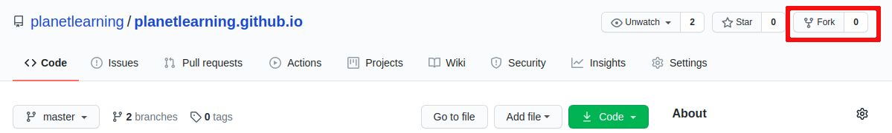
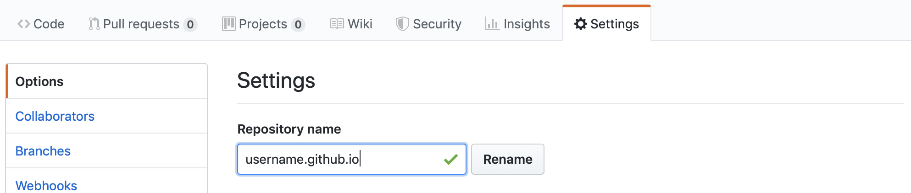

# GitHub

## Objectives

* Learn about GitHub
* Understand the GitHub workflow (including forks and repositories)

## Preparation

[GitHub](https://help.github.com/categories/writing-on-github/) – a web-based hosting service for version control using git, source code management system.

[Git Cheat Sheet](https://github.github.com/training-kit/downloads/github-git-cheat-sheet.pdf) - A resource for commonly used git commands.

## Start Here

Below is a summary of the steps that we will walk you through:

* [Login to GitHub with your username and password](#Login_to_GitHub_with_your_username_and_password)
* [Find and fork the correct repository](#Find_and_fork_the_correct_repository)
* [Go to Settings and rename your repository](#Go_to_Settings_and_rename_your_repository)
* [Check if your github.io works](#Check_if_you_github.io_works)

### Login to GitHub with your username and password

Since you have already created an account on GitHub, we will assume that you understand the basic layout and functionality. If you don't, please explore and do some basic googling.

There is a lot to learn about GitHub, but to acclimatize you to it, we will walk you through a basic example of how to create your own &lt;username&gt;.github.io and allow you to edit and commit your changes.

**NOTE**: Existing GitHub users, please make sure to set your email address per local repository or make sure global settings are accurate. Follow [this](https://help.github.com/articles/setting-your-commit-email-address-in-git/) for more information. To check for your configuration settings, use the command `git config --list` and Git will list all the settings found at this point, including your current email address and username.

### Find and fork the correct repository

Forking is essentially creating a copy of a repository on your own GitHub account, to avoid editing and, possibly, messing up with the main repository.

Now, go to [planetlearning.github.io repository](https://github.com/planetlearning/planetlearning.github.io) and click on the "Fork" button to fork the repository to your own GitHub account.

**NOTE**: It is very important to **distinguish between your personal GitHub account and planetlearning's account**.
As we want to keep a 'clean' version of our code, you should first fork the repository. You should commit any changes you make to a branch on this version of the repository. These changes should be sent back to planetlearning repository through pull requests. planetlearning code will be updated when the pull requests are approved.

### Go to Settings and rename your repository

After you fork the repository, you will be on your repository: &lt;YourUserName&gt;/planetlearning.github.io. Next, you should go to **Settings** at the top middle of the page and rename your repository to &lt;YourUserName&gt;.github.io. See example below.

**Note:** In case you have the **`https://YourUserName.github.io`** in use, please refer to the [FAQ](faq.md).

### Check to see if your github.io works

After renaming your forked repository, go to  `https://YourUserName.github.io` and make sure it works.

Don't worry if you see a **404** page not found error. When you access the link, it will take a while for the page to load and run. Make sure in **Settings > GitHub Pages**, the **source** is set to **_master branch_**.
